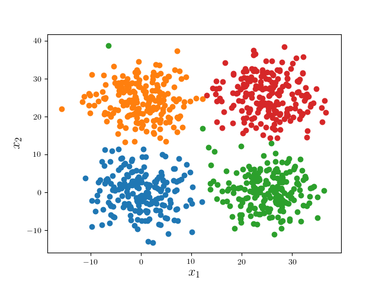

# 2D Mean Shift

*Clustering 2D Points with Mean Shift*

## Introduction

One fundamental question unsupervised learning is to address
is *clustering*. Learning the structural information embedded
in the data. This repo serves as a complementary example
of applying a intricate but not very popular clustering algorithm,
*mean shift*.

Tutorial and discussion mean shift is available at
[Jiayao's
blog](https://zjiayao.github.io/blog/2017/mean-shift-2d://zjiayao.github.io/blog/2017/mean-shift-2d/).

## Dependency

This implementation depends on the "[Approxiamted Nearest Neighobor (ANN) Library](https://www.cs.umd.edu/~mount/ANN/)" for better performance in filtering shift vectors. ANN
can be installed form the link above.

`Python` plotter also requires `matplotlib`. To install it,
one may use

    pip install matplotlib

through `pip` or

    conda install matplotlib

through `anaconda`.

## Installation

First clone this repo:

    git clone https://github.com/zjiayao/ms-2dpnts

We may proceed to build the main program `ms`:

    make ms

That's it, run it to enter interactive mode,
or pipe into a aggregated script such as:

    ./ms < script

## Usage and Features

### Prepare Data

Data files are to be served as the source to the
main program. Data files are space-separated
2D coordinates. When running the program,
it first prompts for the data:

    data file:
    >

### Kernels

Afterwards, one may specify the kernel smoother
used in the algorithm.
Four kernels are provided for density estimation, namely,
Gaussian kernel, linear kernel and Epanechnikov kernel.
The bandwidth is adjustable.

    > gauss
    Data read successfully from "gauss"
    Select kernel:
    [1] Uniform
    [2] Gauss
    [3] Epanechnikov

### Custom Parameters

After kernel selection, one may further specify the
parameters used, this generally includes

- Global Bandwidth

The bandwidth parameter `h` used to specify the activate window.

- Maximum Iterations

The maximum number of iterations seeking the shift vector, default is
50.

- Convergence Criterion

Stopping criterion for mode convergence. By default 0.0001.

- Mode Pruning Criterion

This is problem dependent, it is recommended to set this criterion
larger than the window width (why?). This is especially handy
when running mean shift for several epoches.

### Gathering Result

Thereafter, we may enter the mean shift loop, upon completion, a short
summary is displayed, for example:

    Mean shift started with:
    	Kernel: Gauss
    	Bandwidth: 16
    	Max. Iteration: 50
    	Convergence Toleration: 0.00001000
    	Mode Pruning Diameter: 18.000
    Clustering completed:
    	Clusters: 4
    	Time Elpased: 0.539 sec
    	Avg. Iteration: 34.446
    	[1] View Result and Exit
    	[2] Save Result and Exit
    	[3] Exit

    >

Issue `1` to inspect results; `2` to save results to `cluster/`
folder; `3` to abandon results.

Under choices `1` and `2`, a `log` file is created in the root directory
containing the coordinates of all modes. Under `2`,
different clsuters are written to `cluster/clsuter_?`
where `?` stands for cluster index. Each file is in
`csv` format with header.

### Plotter

Plotters in `R` and `Python` are also included in `cluster/`
for data visualization. To use `R` plotter, one may issue

    cd cluster
    Rscript plot.r

The results are automatically saved to `cluster/Rplots.pdf`.

To use `Python` plotter, at the root directory, one may invoke the script
via:

    python cluster/plot.py

The results are plotted on air using `matplotlib`.

### Automation Script

A sample script file is provided in `examples/script`
for automation the inputting process. The `script`
is later prepared by `examples/sciprt.sh` for
main program to read. To run under automation mode,
one may:

    make example

In essense, this amounts to cut the `script` by
colons, the feed it directly to `stdin`.

## Example: Four Separable Gaussian

Data are contained in `examples/four_gauss`, which
are generated from four Gaussian distribution with same
standard deviation.

The mean shift algorithm seeks the cluster modes:

Pruning those modes (DFS in implementation) yields
the desired result.

An overlay of the clusters and their modes:

