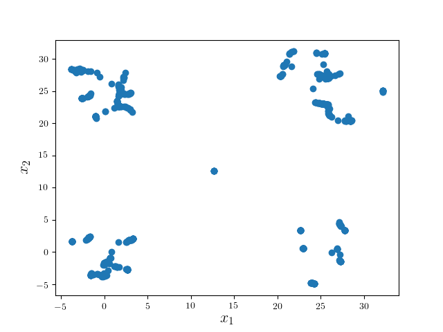
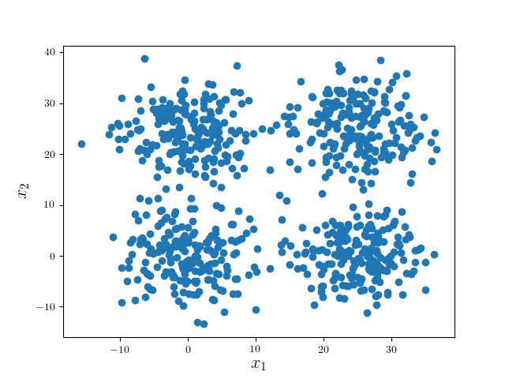
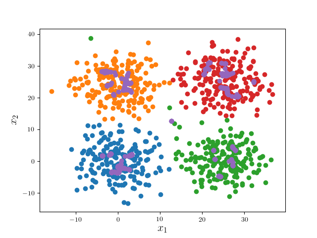

# 2D Mean Shift Example

Clustering 2D Points using Mean Shift

## Usage and Features

Issue `make ms` to build the main program.
To enter the interactive mode, directly run `./ms`;
scripts can be piped for automation purposes.

Data files are $x_1$, $x_2$ coordinates separated
by space.

Four kernels are provided for density estimation, namely,
Gaussian kernel, linear kernel and Epanechnikov kernel.
The bandwidth is adjustable.

## Example: Four Separable Gaussian

Data are contained in `examples/four_gauss`, which
are generated from four Gaussian distribution with same
standard deviation.

The mean shift algorithm seeks the cluster modes:

Pruning those modes (DFS in implmentation) yields
the desired result.

An overlay of the clusters and their modes:

